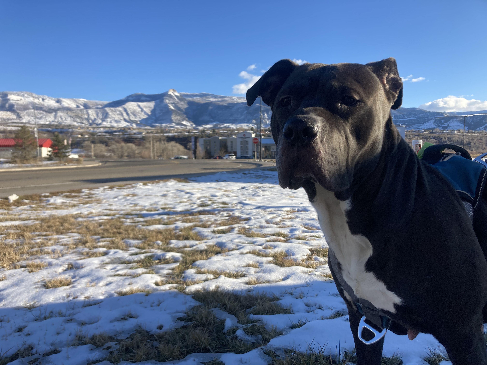

# About Me

I'm Harshawn Ratanpal, and I am a journalist from San Diego currently studying in Washington D.C. I am the proud son of Indian immigrants whom instilled in me the qualities of integrity and hard work.

My journalistic specialties include community reporting, longfrom interviews, and investigative reporting. 

## Why Journalism?

I had many inspirtations for getting into journalism. 

First, I fell in love with telling stories in the fifth grade. In class, we were divided into three groups for spelling tests,
and when one group was taking their test, the other two were tasked with writing, something I'd never taken an interest in. 
I created a story about a man who had gained super powers and was struggling to decide between doing the right thing and abusing his powers.
About mid-way through the year, my teacher said to me "how did you learn to be such a good writer?" which **shocked** me. I had only ever really had a passion
for math, so when she said that, it really made an impact, and it taught me at a young age that the things I think I'm good at and the things I think
I'm bad at are variables, not constants. That one remark she made changed my entire life's trajectory. 

A bit later, I got really into video games, particularly one called *inFAMOUS 2*. I was so obsessed with the game's plot that I wanted to learn
everything I could about the game, so I looked it up online, where I found tons of articles and reviews about it,
including [this review](https://www.ign.com/articles/2011/05/27/infamous-2-review-2) from IGN, a video game news site. 
I had no idea that this merging of two of my passions, writing and video games, existed, so I decided that day that I wanted to be a video game journalist. 

After a couple more years, I had some journalism experience from working on school papers, and I found a general love of journalism.
When I was in high school, an investigative reporter in my hometown was [directly responsible](https://timesofsandiego.com/politics/2019/12/03/how-a-384-word-story-by-morgan-cook-led-to-duncan-hunters-guilty-plea/)
for the indictment of a U.S. House Representative on campaign finance fraud charges. This beautiful example of the impact of journalism
inspired me to become an investigative reporter, the path I'm now. 

## Gaia
 

I began fostering for an organization called Second Chance in Columbia. My first dog was a pitbull mix named Gaia. 
Gaia was not treated properly when she was a pup, which led to a myriad of health issues throughout her life.
Thankfully, she'd been rescued by the organization, and most of her issues have been solved, however, she has a lack of personal boundaries, gets way 
too excited to meet new people and makes a poor first impression. Thus, it's been hard to find an adopter. After almost a year, organization decided the best thing to do
would be to euthanize her, so resources could be diverted to dogs that stand more of a chance. Instead, after a few months of fostering her, I adopted her
with the hopes of finding her a more permanent home myself. 

## Travel
After not travelling out of the country for over a decade, I went to Mongolia last summer and had an excellent time. The countryside is beautiful,
the people are incredibly hospitable and the culture is fascinating. I cannot wait to go back again. 

*** 
#### Learn all about Harshawn by using this site navigator!
<ol>
  <li>Home</li>
  <li>Work and Education</li>
  <li>Contact Me</li>
  <li>More about Me</li>
  <li>Hobbies and Interests</li>
</ol>  

